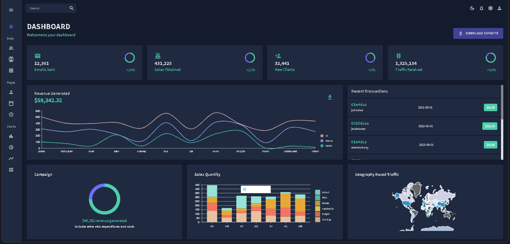
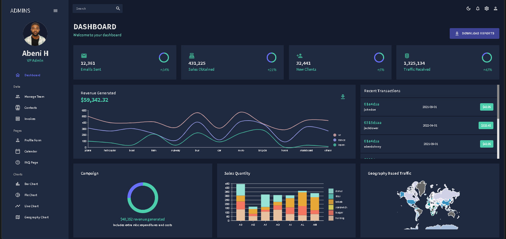
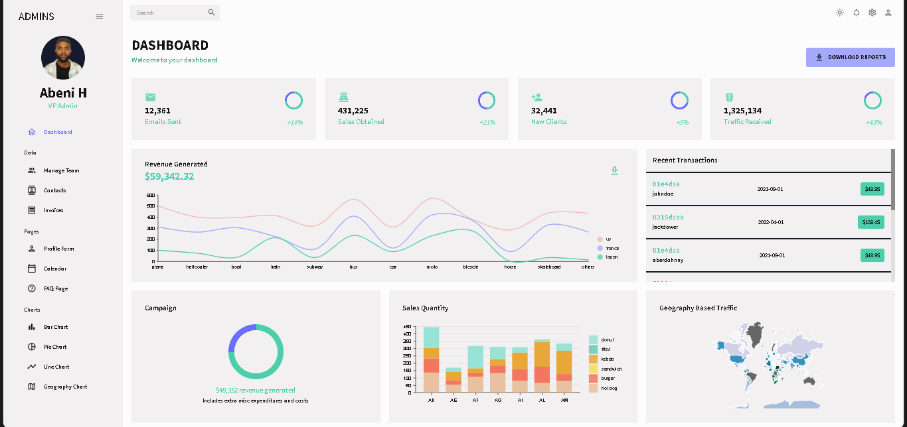
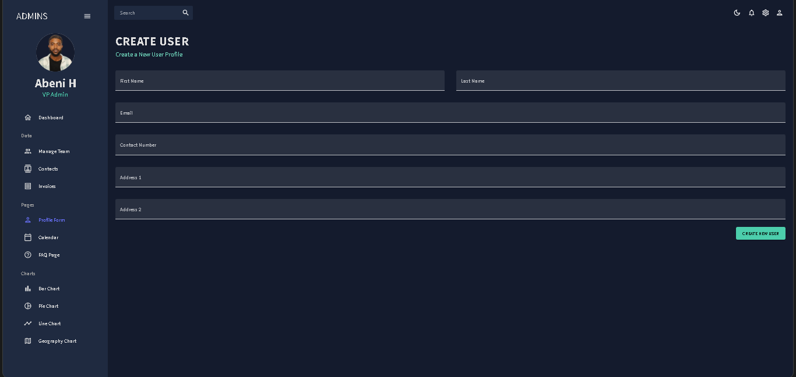
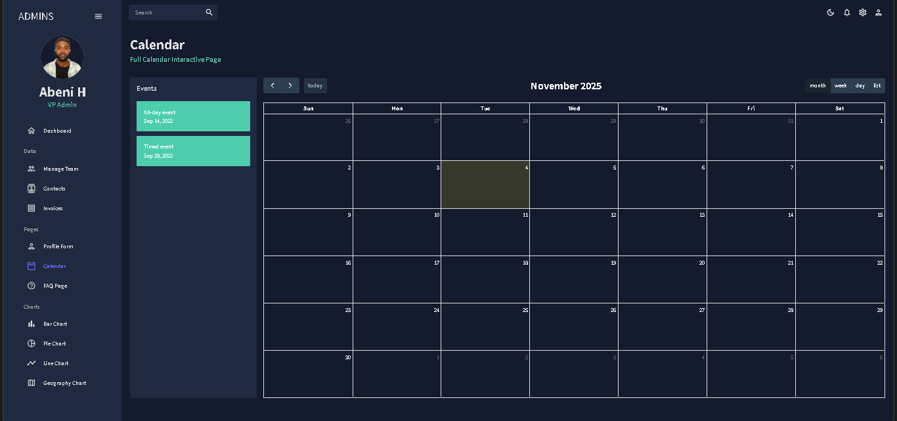

# React Admin Dashboard

A comprehensive **Admin Dashboard web application** built with modern React ecosystem tools and enterprise-grade libraries.

## Features

- **React**
- **Material UI (MUI)** 
- **Light & Dark Mode** 
- **Responsive Sidebar Navigation**
- **Data Tables with MUI Data Grid**
  - Sorting, filtering, export, and custom cell rendering
- **Authentication & Profile Form** with validation
  - Built via **Formik** & **Yup**
- **Interactive FullCalendar Integration**
- **Dynamic Data Visualization** using **Nivo Charts**
  - Includes Bar, Line, Pie, and Geography charts
- **FAQ Page** using MUI Accordions
- **Reusable architecture** with modular React components
- **Google Fonts** integration for beautiful typography

## Installation

1. Clone the repository:
  

2. Install dependencies:
   
   npm install
   
   **Note:** For sidebar compatibility, use:
   
    npm install react-pro-sidebar@0.7.1
   

3. Start the development server:
   
   npm start
   
